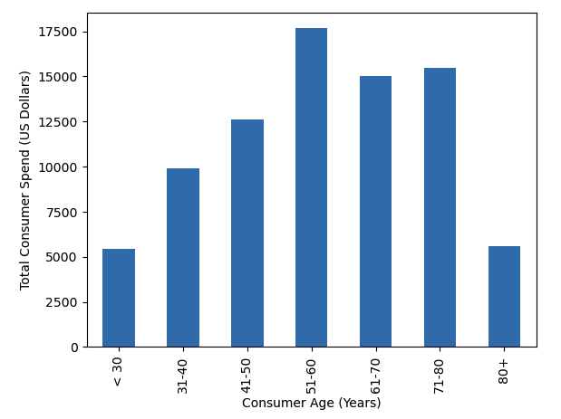
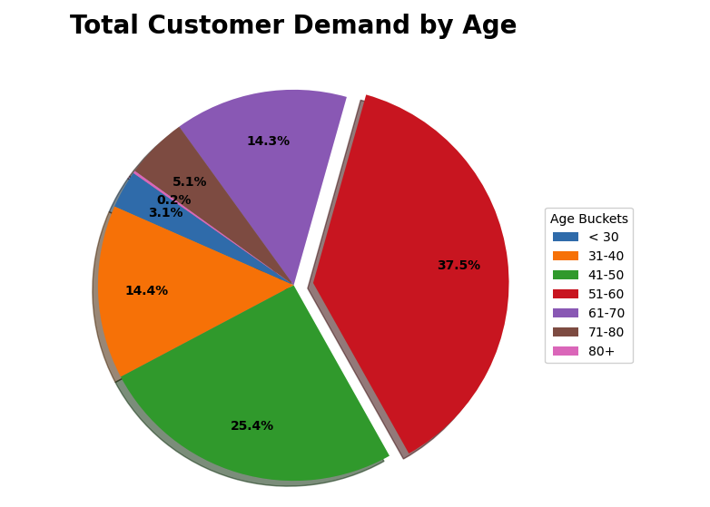

# Retail_Analysis

## About

In this final project, we partnered with Anthropologie, a retail store, to analyze a portion of their customer base. It is important to note that the given retail dataset is not reflective of the company as a whole and all identifying features have been anonymized. 

## Purpose

The goal of this project is to make predictions about a customer based on previous behaviors and demographic  features. The analysis performed should answer the question:

* Can customer feature demand (lifetime purchase) be accurately determined?

## Process

- Perform exploratory analysis on demographic features
- Determine how demographics can be used to segment the customer base to allow for personalized and marketing techniques. 
- Determine how demographics and previous behavior affect a customer’s propensity to buy.
- Establish machine learning models to predict customer spend.

## Resources

- Python version 3.9,  Pandas, Matplotlib, SQLAlchemy, SkLearn, Tableau, pgAdmin4, SQL

## The Data 

A dataset was acquired from a US retailer that spans across 3 years.  This dataset included information on the customer, their order history, and their demographics. For privacy purposes, the dataset is not included in this repository.

## Database
A database was created in pgAdmin4

## Demographic Exploratory Analysis

The dataset was cleaned using Pandas. Data types were changed to either INT or DATETIME. Null values were removed or replaced with the correct date. Unnecessary columns were dropped. Outliers were identified and filtered out so analysis could be performed on a more typical customer.

- Example:  Direct sales do not have a zip code so data needed to be added.
- Example:  LOYALTY_ENROLLMENT_DT was only included for a small percentage of rows so it did not contribute to the overall analysis.
- Analysis was performed for customers with LIFETIME_APPAREL_DEMAND that was less than $100,000.

Initial analysis to identify potential groupings that might affect customer demand was performed by looking at pivot tables and summaries of the data frame. According to the data, there was an opportunity to explore the relevance of four customer demographic features including: Age, Location, Income, and Ethnicity. The four features were analyzed separately in order to evaluate how they individually affected total customer demand. Within the initial analysis, multiple graphs and charts were created to understand each demographic's impact on customer spend. Additional visualizations were created within Tableau.

#### Age Analysis

- Customer ages were put into buckets for easier analysis: < 30 years old, 31-40 years old, 41-50 years old, 51-60 years old, 61-70 years old, 71-80 years old, 80+ years old.
- The age group with the highest average lifetime demand was 51-60 years old.

- The age group with the highest total  lifetime demand was also 51-60 years old.
- Groups that could be potentially targeted for growth include the customers below 50 years old, especially those under 30 years old who are barely represented in the sales data.

#### Income Analysis

- The income brackets with the highest concentration of Anthropologie customers are between $75,000 and $124,999 a year as well as customers with incomes $200,000 and above. Customers making less than $75k a year are uncommon. Customers making between $125k and $200k are also less frequent.

- The income bracket with the highest lifetime spending was $100,000-$124,999.

- The income bracket with the highest lifetime quantity purchased was $100,000-$124,999.

#### Location Analysis

In order to perform the analysis on customer location, the uszipcode library was imported to convert zips codes to states. Once this information was retrieved, the states were grouped into the following regions:
- South: TX, OK, AR, LA, MS, AL, FL, GA, SC, NC, VA, DC, MD, DE, WV, KY, TN
- West: HI, AK, CA, OR, WA, MT, ID, NV, AZ, NM, CO, UT, WY
- Midwest: ND, SD, NE, KS, MN, IA, MO, WI, IL, IN, MI, OH
- Northeast: PA, NY, VT, ME, NH, MA, CT, RI, NJ
- Other: AE, AP

The Region with the highest demand amount based was the South at $5,544,452.10. The Region with the highest lifetime apparel demand amount was the Midwest at $4,734,541,000. The Region with the highest number of unique customer IDs was the South with 46,139.

#### Ethnicity Analysis

The Ethnicity with the highest purchase demand was Western Europeans “K” at 180366 and the lowest was Polynesian “H” at 4

This shows the lifetime demand by basic count
https://public.tableau.com/app/profile/mark.o.brien7928/viz/Ethnicgroupbubble/Sheet2?publish=yes

This shows average lifetime demand in an average instead of basic count
https://public.tableau.com/app/profile/mark.o.brien7928/viz/Ethnicgroupbubble/Sheet22?publish=yes

## Machine Learning Model

## Summary
