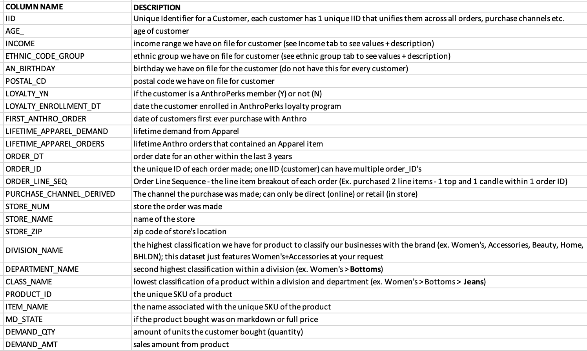
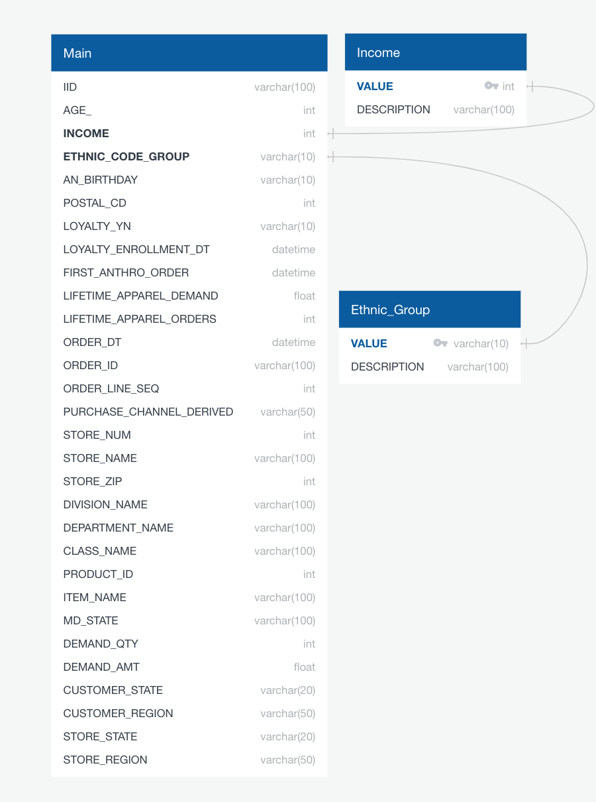
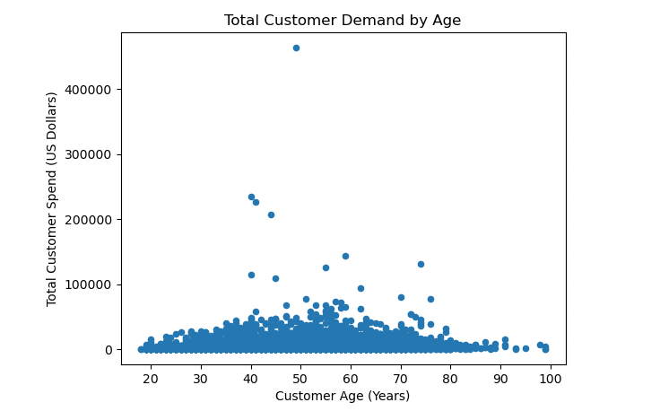
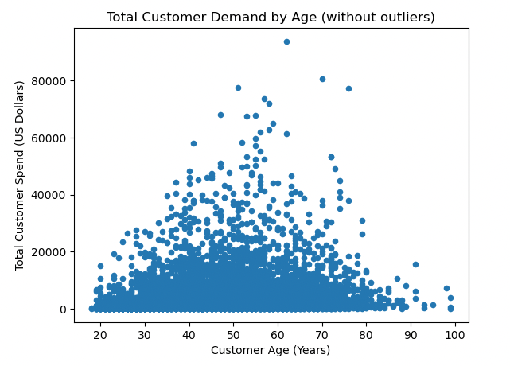
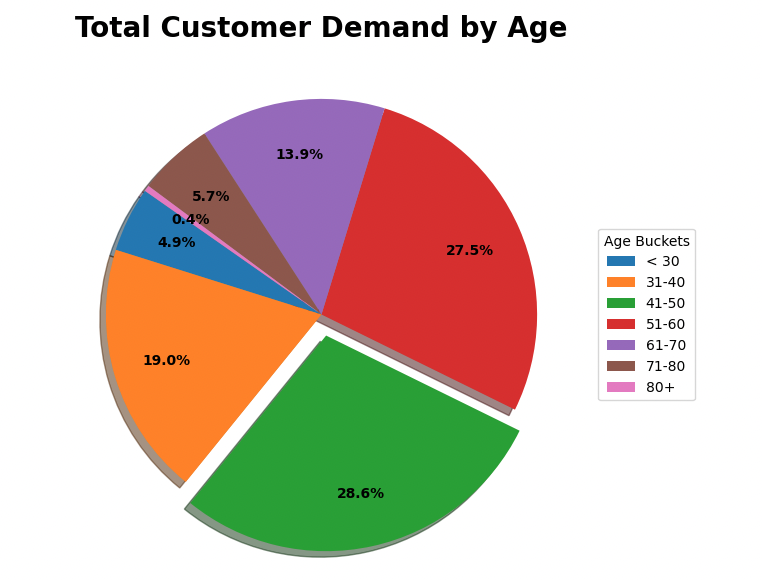
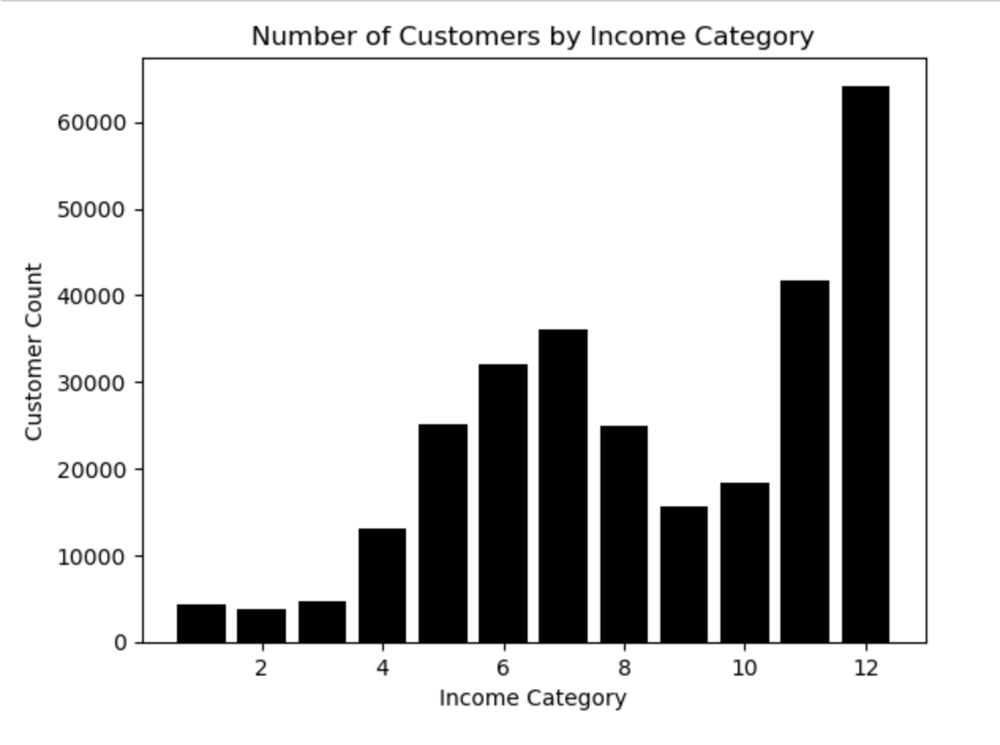
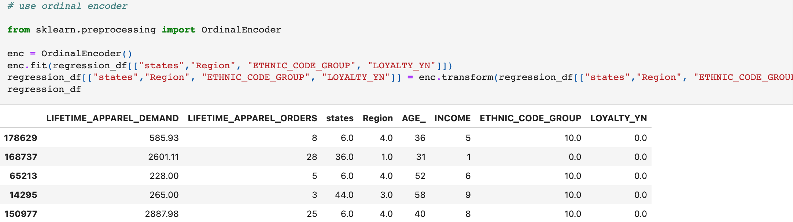

# Retail_Analysis

## About

In this final project, we partnered with Anthropologie, a retail store, to analyze a portion of their customer base. It is important to note that the given retail dataset is not reflective of the company as a whole and all identifying features have been anonymized. 

## Purpose

The goal of this project is to make predictions about a customer based on previous behaviors and demographic  features. The analysis performed should answer the question:

* Can customer lifetime purchase be accurately determined based on certain buying behaviors, demographic and aggregate features? If the answer is yes, which features are most important in the model prediction? 

## Process

- Perform exploratory analysis on demographic features
- Determine how demographics can be used to segment the customer base to allow for personalized and marketing techniques. 
- Determine how demographics and previous behavior affect a customer’s propensity to buy using machine learning models to predict customer spend.

## Links

- Project Slides: https://docs.google.com/presentation/d/1t2-KWQom2fe83HFV_6Ij2cqNIqFPrRmsQRdB6cvJqaQ/edit?usp=sharing
- Tableau: 

## Resources

- Python version 3.9,  Pandas, Matplotlib, SQLAlchemy, SkLearn, Tableau, pgAdmin4, SQL

## The Data 

A dataset was acquired from a US retailer that spans across 3 years.  This dataset included information on the customer, their order history, and their demographics. For privacy purposes, the dataset is not included in this repository.

## The Data 

A dataset was acquired from a US retailer that spans across 3 years.  This dataset included information on the customer, their order history, and their demographics. For privacy purposes, the dataset is not included in this repository.

## Data Cleaning

The dataset was cleaned using Pandas. Data types were changed to either INT or DATETIME. Null values were removed or replaced with the correct date. Unnecessary columns were dropped. Outliers were identified and filtered out so analysis could be performed on a more typical customer.

- Example:  Direct sales do not have a zip code so data needed to be added.
- Example:  LOYALTY_ENROLLMENT_DT was only included for a small percentage of rows so it did not contribute to the overall analysis.
- Analysis was performed for customers with LIFETIME_APPAREL_DEMAND that was less than $100,000.

## Database

A database was created in pgAdmin4 from the cleaned data set. It was broken up into multiple tables including:. Using SQL, multiple queries were run on the data to further explore the features and their impact on customer lifetime demand. 

## Demographic Exploratory Analysis

Initial analysis to identify potential groupings that might affect customer demand was performed by looking at pivot tables and summaries of the data frame. After further investigation, there was an opportunity to explore the relevance of four customer demographic features including: Age, Location, Income, and Ethnicity. The four features were analyzed separately in order to evaluate how they individually affected total customer demand. Multiple graphs and charts were created to understand each demographic's impact on customer spend. Additional visualizations were created within Tableau.

#### Age Analysis

- Total customer spend can be visualized with a scatter plot and shows some obvious outliers.

 

- The outliers can be removed and a more general customer can be analyzed by visualizing customer spend below $100,000.

- Customer ages were put into buckets for easier analysis: < 30 years old, 31-40 years old, 41-50 years old, 51-60 years old, 61-70 years old, 71-80 years old, 80+ years old.
- The age group with the highest average lifetime demand was 71-80 years old

- The age group with the highest total  lifetime demand was also 41-50 years old.

- One group that could be potentially targeted for growth is the “under 30 years old” customer group, who are barely represented in the sales data.

#### Income Analysis

- The income brackets with the highest concentration of Anthropologie customers are between $75,000 and $124,999 a year as well as customers with incomes $200,000 and above. Customers making less than $75k a year are uncommon. Customers making between $125k and $200k are also less frequent.

- The income bracket with the highest lifetime spending was $100,000-$124,999.

![amount_spent]images/amt_spent_income.png)

- The income bracket with the highest lifetime quantity purchased was $100,000-$124,999.

#### Location Analysis

In order to perform the analysis on customer location, the uszipcode library was imported to convert zips codes to states. Once this information was retrieved, the states were grouped into the following regions:
- South: TX, OK, AR, LA, MS, AL, FL, GA, SC, NC, VA, DC, MD, DE, WV, KY, TN
- West: HI, AK, CA, OR, WA, MT, ID, NV, AZ, NM, CO, UT, WY
- Midwest: ND, SD, NE, KS, MN, IA, MO, WI, IL, IN, MI, OH
- Northeast: PA, NY, VT, ME, NH, MA, CT, RI, NJ
- Other: AE, AP

Discoveries made included:
- Over the course of three years, the region with the highest demand was the South at $5,544,452.10 followed by the West.
- The Region with the highest lifetime apparel demand amount was the Midwest at $4,734,541,000. 
- California had the highest demand in both demand and quantity followed by Texas, New York, and Illinois.
-The Region with the highest number of unique customer IDs was the South with 46,139.
- All regions see a spike in demand from October to December and a drastic dip in January to February. 
- Mark down business out performs full price in all Regions from January until October. After October full price business out performs markdowns in all regions

#### Ethnicity Analysis

-The Ethnicity with the highest purchase demand was Western Europeans “K” at 180366 and the lowest was Polynesian “H” at 4

## Machine Learning Model
The model chosen to predict customer lifetime value was a Random Forest Regression. This model uses ensemble learning, meaning it trains multiple weak learners then combines their predictions before training more weak learners.  This leads to a more robust model that is less susceptible to erroneous data. 

### Machine Learning Preprocessing Steps

In order to prepare the dataset for the model, additional steps were taken to clean the data frame
- Aggregate features were retrieved for customer spend, percent direct vs in store, and time between each order by customer
- A new data frame was created that retrieved a customer’s current lifetime demand based on last purchase. This dataframe was unique on the customer’s ID.
- The aggregate features per customer was added to the new data frame.
- All unneeded columns were dropped.
- The string values were converted to numerical instances with 
- The target value “LIFETIME_APPAREL_DEMAND” was pulled from the dataframe, the dependent variable.
- All other columns were considered features, the independent variable.
- The data was split into test and train and the model was trained.

### Machine Learning Results

## Summary
