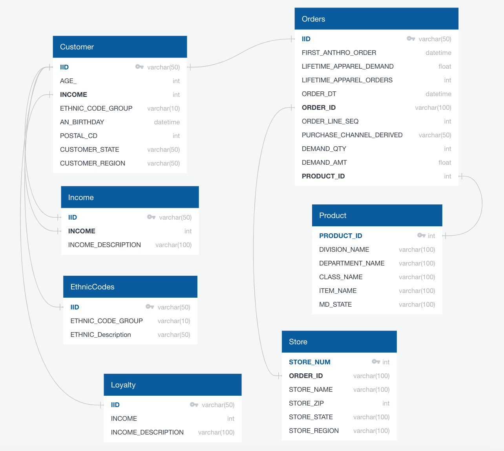
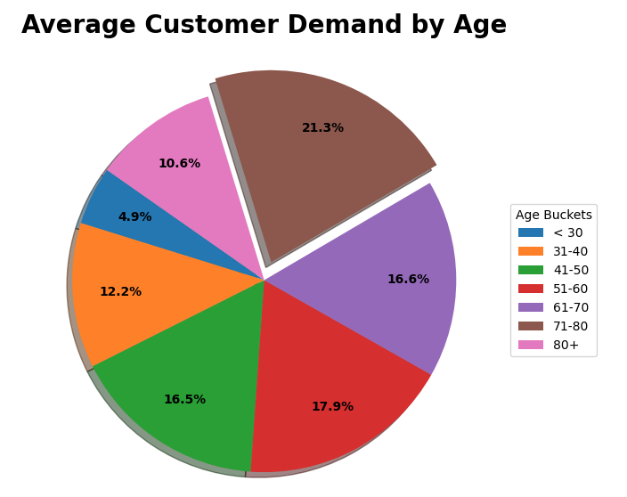
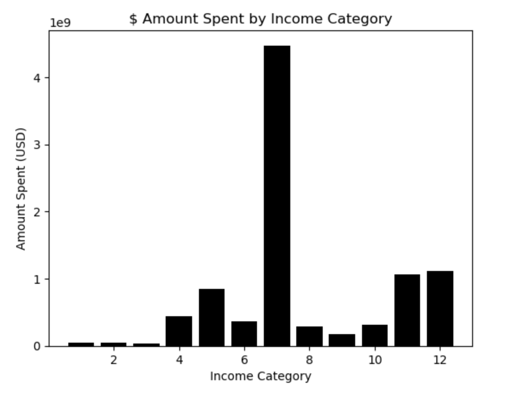
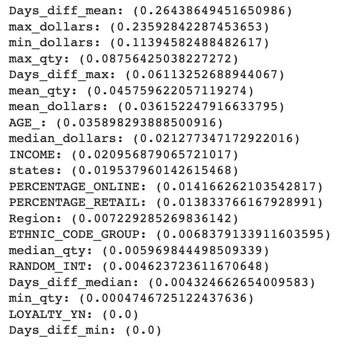

# Retail_Analysis

*In this final project, we partnered with Anthropologie, a retail store, to analyze a portion of their customer base. It is important to note that the given retail dataset is not reflective of the company as a whole and all identifying features have been anonymized.*

## Purpose

The goal of this project is to make predictions about a customer based on previous behaviors and demographic  features. The analysis performed should answer the question:

* Can customer lifetime purchase be accurately determined based on certain buying behaviors, demographic and aggregate features? If the answer is yes, which features are most important in the model prediction? 

## Links

- Project Slides: [Slide Link](https://docs.google.com/presentation/d/1t2-KWQom2fe83HFV_6Ij2cqNIqFPrRmsQRdB6cvJqaQ/edit?usp=sharing)
- Tableau: [Link to tableau](https://public.tableau.com/views/AnthropologieAnalysis/MapView?:language=en-US&publish=yes&:display_count=n&:origin=viz_share_link)

## Process

- Perform exploratory analysis on demographic features
- Determine how demographics can be used to segment the customer base and their overall importance to customer lifetime value. 
- Determine how demographics and previous behavior affect a customer’s propensity to buy using machine learning models to predict customer spend.

## Resources

- Python version 3.9,  Pandas, Matplotlib, SQLAlchemy, SkLearn, Tableau, pgAdmin4, SQL

## The Data 

A dataset was acquired from a US retailer that spans across 3 years.  This dataset included information on the customer, their order history, and their demographics. For privacy purposes, the dataset is not included in this repository.

## Data Cleaning

The dataset was cleaned using Pandas. Data types were changed to either INT or DATETIME. Null values were removed or replaced with the correct date. Unnecessary columns were dropped. Outliers were identified and filtered out so analysis could be performed on a more typical customer.

- Example:  Direct sales do not have a zip code so data needed to be added.
- Example:  LOYALTY_ENROLLMENT_DT was only included for a small percentage of rows so it did not contribute to the overall analysis.
- Analysis was performed for customers with LIFETIME_APPAREL_DEMAND that was less than $100,000.

## Database

A customer database was created in pgAdmin4 from the cleaned data set. It was broken up into multiple tables representing the data set in its original form. This included a table or the complete data, a table of ethnicity codes, and a table or income brackets. 

In an ideal setting, the customer database would be representative of how a company might utilize it. Pictured below is the optimal database for a retailer. This database contains far more tables that interact on different primary keys. The relationships between the tables could be used to run SQL queries identifying patterns and trends in consumer behavior.

## Demographic Exploratory Analysis

Initial analysis to identify potential groupings that might affect customer demand was performed by looking at pivot tables and summaries of the data frame. After further investigation, there was an opportunity to explore the relevance of four customer demographic features including: Age, Location, Income, and Ethnicity. The four features were analyzed separately in order to evaluate how they individually affected total customer demand. Multiple graphs and charts were created to understand each demographic's impact on customer spend. Additional visualizations were created within Tableau.  [Link to tableau](https://public.tableau.com/views/AnthropologieAnalysis/MapView?:language=en-US&publish=yes&:display_count=n&:origin=viz_share_link)

#### Age Analysis

- Total customer spend can be visualized with a scatter plot and shows some obvious outliers.

 

- The outliers can be removed and a more general customer can be analyzed by visualizing customer spend below $100,000.

- Customer ages were put into buckets for easier analysis: < 30 years old, 31-40 years old, 41-50 years old, 51-60 years old, 61-70 years old, 71-80 years old, 80+ years old.
- The age group with the highest average lifetime demand was 71-80 years old

- The age group with the highest total  lifetime demand was 41-50 years old.

- One group that could be potentially targeted for growth is the “under 30 years old” customer group, who are barely represented in the sales data.

#### Income Analysis

- The income brackets with the highest concentration of Anthropologie customers are between $75,000 and $124,999 a year as well as customers with incomes $200,000 and above. Customers making less than $75k a year are uncommon. Customers making between $125k and $200k are also less frequent.

- The income bracket with the highest lifetime spending was $100,000-$124,999.
- The income bracket with the highest lifetime quantity purchased was $100,000-$124,999.

#### Location Analysis

In order to perform the analysis on customer location, the uszipcode library was imported to convert zips codes to states. Once this information was retrieved, the states were grouped into the following regions:
- South: TX, OK, AR, LA, MS, AL, FL, GA, SC, NC, VA, DC, MD, DE, WV, KY, TN
- West: HI, AK, CA, OR, WA, MT, ID, NV, AZ, NM, CO, UT, WY
- Midwest: ND, SD, NE, KS, MN, IA, MO, WI, IL, IN, MI, OH
- Northeast: PA, NY, VT, ME, NH, MA, CT, RI, NJ
- Other: AE, AP

Discoveries made included:
- Over the course of three years, the region with the highest demand was the South at $5,544,452.10 followed by the West.
- The Region with the highest lifetime apparel demand amount was the Midwest at $4,734,541,000. 
- California had the highest demand in both demand and quantity followed by Texas, New York, and Illinois.
-The Region with the highest number of unique customer IDs was the South with 46,139.
- All regions see a dramatic increase in demand from October to December and a drastic dip in January to February, likely due to the holiday season.
- All regions experience an increase in demand during the month of May. Further analysis could show if this is due to Mother’s Day.
- States with top demand include in descending order: California, Texas, New York, Illinois, Florida, and Pennsylvania. 
- Mark down business out performs full price in all Regions from January until October. After October full price business out performs markdowns in all regions. Further analysis could show if this is due to the holiday season.

#### Ethnicity Analysis

- In general, the Ethnicity with the highest purchase demand was Western Europeans “K” at 180366 and the lowest was Polynesian “H” at 4.  Western Europeans are overwhelmingly the biggest purchasers.

## Machine Learning Model

### Machine Learning Preprocessing Steps
- The model chosen to predict our target variable of Lifetime Customer  was a Random Forest Regression.  This model uses ensemble learning, meaning it trains multiple weak learners then combines their predictions before training more weak learners.  This leads to a more robust model that is less susceptible to erroneous data. We chose this model because it is good at predicting continuous values, like future lifetime customer demand.   
- Originally the cleaned, raw data was used to train and fit the model. However, it was realized that there were multiple rows per IID (customer) which was inflating the values for lifetime customer demand.  To account for this, a new dataset was created with only the most recent recent values for  'LIFETIME_APPAREL_DEMAND', 'AGE_', 'INCOME', 'ETHNIC_CODE_GROUP', 'LOYALTY_YN', 'states', and 'Region’.  
- An aggregate column for Customer Spend (min, max, mean, and median for order dollars and quantities), percent direct orders vs in-store, and the average time between each order per customer was created.  These aggregate columns were combined with the IID (customer ID) dataset so only relevant data was included in the model.  
- Categorical data was changed into numeric data using sklearn Ordinal Encoder and created a random integer column to use a baseline for feature importance.  If the features were less important than the random integer column, they were dropped from the feature set and the model was re-run.  

 

### Machine Learning Results and Optimization
Since a regression model was used the best way to interpret the models performance is using metrics such as the R2, mean absolute value, and mean squared error. Throughout the process the model saw improvements. It began with the initial model:

In the initial machine learning, with all features included the results were:

- R2: 0.580
- Mean Absolute Error: 2443.92
- Mean Squared Error: 63252742.06

The second model used the random integer method to determine which features were least important to the model and could be dropped. The results for this model were:

- R2 0.5815
- Mean Absolute Error: 2449.4579
- Mean Squared Error:63082664.539

In the third model, XGBoost was applied to see if there would be any improvement. XGBoost is another form of ensemble learning where learners are trained on residual errors of previous learners. This provides stronger importance to misclassified observations and reduces overall error of in model.The results had the best R2 however the mean absolute error was not as low as the previous two renditions:

-  R2 0.5996
- Mean Absolute Error: 2605.140
- Mean Squared Error: 60348918.512:

After further analysis it was determined that the model was being influenced by significant outliers. A rule was established to drop any values that were greater than three standard deviations away from the mean value. This rule was applied to both the Random Forest Regression and the XGBoost model. The Random Forest Regression saw improvement in its R2 while XGBoost experienced a decrease. Both models showed improvements in their mean absolute error. Next the hyper-parameters were tuned using Grid Search with Cross Validation to select the optimal parameter values. This produced our top models.

The Random Forest Model saw significant improvement. 

- R2
- Mean Absolute Error:
- Mean Squared Error

Tableau was utilized to further explore and visualize the relationship between the top four important features in the machine learning model compared to the demographics analyzed earlier in the project.  [Link to tableau](https://public.tableau.com/views/AnthropologieAnalysis/MapView?:language=en-US&publish=yes&:display_count=n&:origin=viz_share_link)

## Summary
